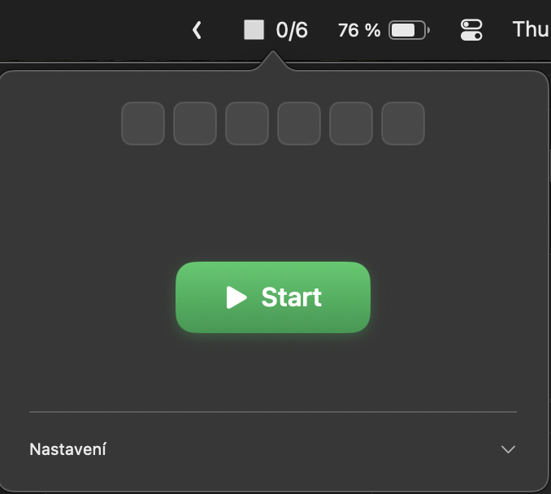
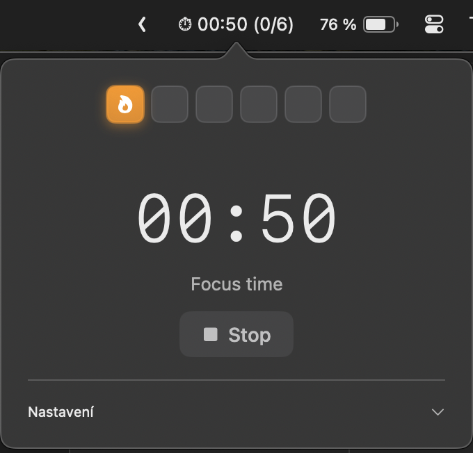
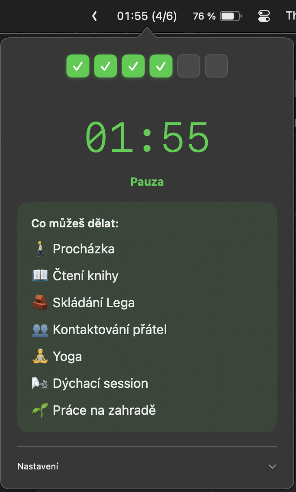

# FocusBlocks

Minimalistická macOS menu bar aplikace pro správu focus bloků pomocí Pomodoro techniky. Pomáhá udržet produktivitu a zabránit vyhoření díky strukturovaným pracovním blokům a pravidelným pauzám.

**[⬇️ Stáhnout poslední verzi (ZIP)](builds/FocusBlocks.zip?raw=true)**

## Screenshoty

| Úvodní obrazovka | Focus blok | Pauza s aktivitami |
|:---:|:---:|:---:|
|  |  |  |

## K čemu aplikace slouží

FocusBlocks je navržen pro lidi, kteří chtějí:
- Pracovat v soustředěných blocích bez rozptylování
- Mít jasný přehled o tom, kolik práce už dnes odvedli
- Dostávat připomínky na pravidelné pauzy
- Vědět, kdy je čas skončit s prací

## Funkce

### Základní funkce
- **10 focus bloků** po 30 minutách denně (konfigurovatelné)
- **5 minutové pauzy** mezi bloky s návrhy aktivit
- **Vizuální počítadlo** v menu baru (např. "3/10")
- **Časovač** zobrazený přímo v menu baru během focus bloku
- **Automatický reset** o půlnoci - každý den začínáš čistě
- **Připomínky** pokud zapomeneš začít další blok

### Integrace
- **Focus Mode** - automaticky zapíná/vypíná režim Nerušit přes Shortcuts
- **RescueTime** - automaticky spouští FocusTime session pro sledování produktivity
- **Kalendář** - zaznamenává dokončené bloky do kalendáře

### Vizuální prvky
- Barevné čtverečky ukazující průběh dne (zelená = hotovo, modrá = probíhá, šedá = zbývá)
- Přehled časů dokončených bloků
- Návrhy relaxačních aktivit během pauzy

## Instalace

### 1. Vytvoř Shortcuts pro Focus Mode

V aplikaci **Shortcuts** (Zkratky) vytvoř dva shortcuts:

#### Shortcut "Start Focus"

1. Otevři aplikaci **Shortcuts** (Zkratky)
2. Klikni na **+** pro vytvoření nové zkratky
3. Pojmenuj ji přesně **"Start Focus"**
4. Klikni na **Add Action** (Přidat akci)
5. Vyhledej **"Set Focus"** (Nastavit soustředění)
6. Vyber akci **Set Focus**
7. V akci nastav:
   - Focus: **Do Not Disturb** (Nerušit) nebo vlastní Focus profil
   - Turn: **On** (Zapnout)
8. Ulož zkratku

```
┌─────────────────────────────────┐
│  Start Focus                    │
├─────────────────────────────────┤
│  Set Focus                      │
│  ┌───────────────────────────┐  │
│  │ Turn [Do Not Disturb] On  │  │
│  └───────────────────────────┘  │
└─────────────────────────────────┘
```

#### Shortcut "Stop Focus"

1. Vytvoř novou zkratku
2. Pojmenuj ji přesně **"Stop Focus"**
3. Přidej akci **Set Focus**
4. V akci nastav:
   - Focus: **Do Not Disturb** (Nerušit)
   - Turn: **Off** (Vypnout)
5. Ulož zkratku

```
┌─────────────────────────────────┐
│  Stop Focus                     │
├─────────────────────────────────┤
│  Set Focus                      │
│  ┌───────────────────────────┐  │
│  │ Turn [Do Not Disturb] Off │  │
│  └───────────────────────────┘  │
└─────────────────────────────────┘
```

#### Vlastní Focus profil (volitelné)

Můžeš si vytvořit vlastní Focus profil pro práci:

1. Otevři **System Settings** → **Focus**
2. Klikni na **+** a vyber **Custom**
3. Pojmenuj ho např. "Deep Work"
4. Nastav:
   - Allowed Notifications: None (nebo vybrané kontakty)
   - Allowed Apps: None (nebo vybrané aplikace)
   - Focus Filters: Skryj nepotřebné aplikace
5. V Shortcuts pak vyber tento profil místo "Do Not Disturb"

### 2. RescueTime API Key (volitelné)

1. Jdi na https://www.rescuetime.com/anapi/manage
2. Vygeneruj nový API key
3. Vlož ho do nastavení v aplikaci

### 3. Build aplikace

```bash
cd FocusBlocks
open FocusBlocks.xcodeproj
```

V Xcode:
1. `Cmd+B` pro build
2. `Cmd+R` pro spuštění
3. Product → Archive pro release verzi

### 4. Trvalá instalace

1. Najdi `FocusBlocks.app` v build složce
2. Přesuň do `/Applications`
3. Přidej do Login Items (System Settings → General → Login Items) pro automatické spouštění

## Použití

1. **Klikni na ikonu** v menu baru pro otevření okna
2. **Start** - začne 30minutový focus blok
3. Po skončení bloku uslyšíš zvuk a zobrazí se návrh aktivity pro pauzu
4. Po 5minutové pauze můžeš začít další blok
5. **Po 10. bloku** se zobrazí "DOST" - čas zavřít notebook!

### Menu bar indikátory

| Stav | Zobrazení |
|------|-----------|
| Focus blok | `25:43 (3/10)` |
| Pauza | `04:12 (3/10)` |
| Čekání | `3/10` |
| Hotovo | `DOST` |

## Nastavení

V aplikaci lze nastavit:
- **Počet bloků** - kolik bloků chceš za den (výchozí: 10)
- **Délka bloku** - délka focus bloku v minutách (výchozí: 30)
- **Délka pauzy** - délka pauzy v minutách (výchozí: 5)
- **Připomínka** - za kolik minut připomenout další blok (výchozí: 15)
- **Spustit při startu** - automaticky spustí aplikaci po přihlášení
- **RescueTime API** - klíč pro integraci s RescueTime
- **Otevřít RescueTime po bloku** - automaticky otevře RescueTime dashboard v prohlížeči po dokončení každého bloku (výchozí: zapnuto)

## Aktivity pro pauzy

Během pauzy aplikace náhodně navrhne jednu z těchto aktivit:
- Procházka
- Čtení knihy
- Skládání Lega
- Kontaktování přátel
- Yoga
- Dýchací cvičení
- Práce na zahradě

## Technické detaily

- **Platforma:** macOS 13.0+
- **Framework:** SwiftUI + AppKit
- **Ukládání dat:** UserDefaults
- **Kalendář:** EventKit
- Aplikace běží jako menu bar app (bez ikony v Docku)

## Oprávnění

Aplikace vyžaduje:
- **Kalendář** - pro záznam dokončených bloků
- **Shortcuts** - pro ovládání Focus Mode

## Tipy

- Nastav si vlastní Focus profil v System Settings pro lepší kontrolu nad notifikacemi
- Používej RescueTime pro sledování, jak efektivně trávíš čas během bloků
- Respektuj "DOST" signál - je důležité vědět, kdy přestat
